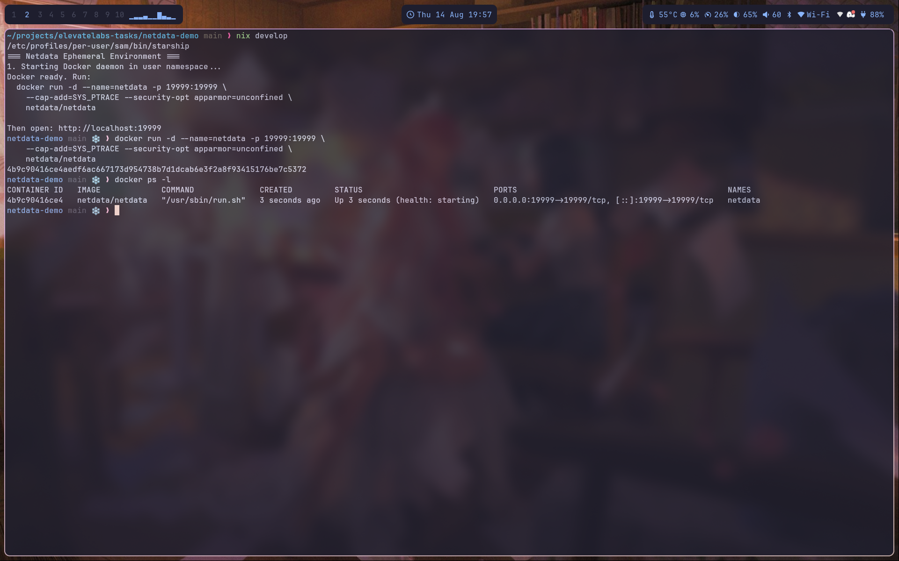
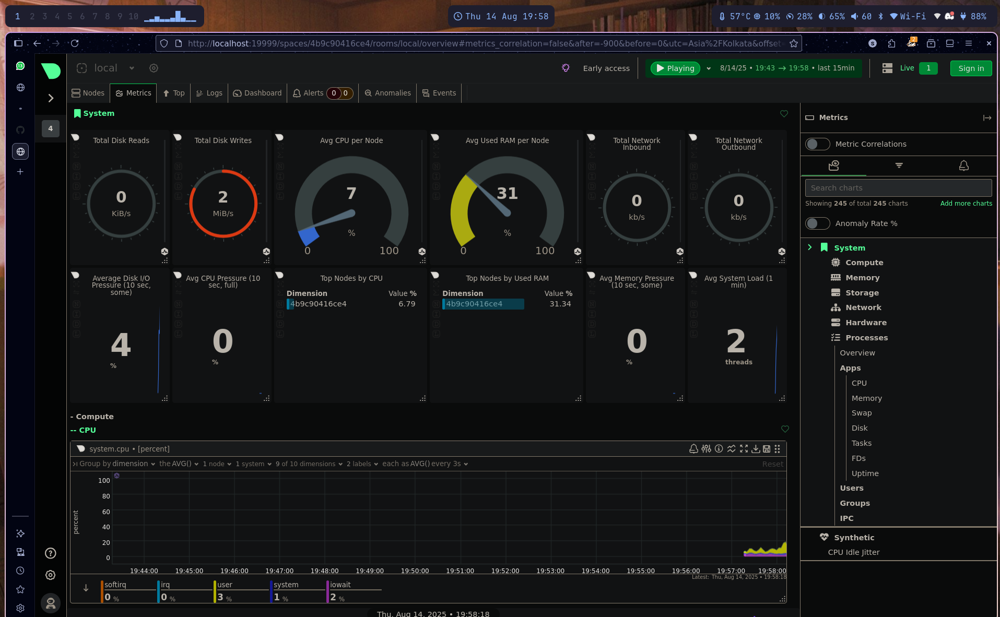

# netdata-demo

Ephemeral Netdata-on-Docker environment powered by a Nix flake.

## Prerequisites
- Nix with flakes enabled
- Linux user account (rootless Docker will be started automatically inside the dev shell)

## Quick start (using the flake)
1) Enter the dev shell (this sets up rootless Docker and exports DOCKER_HOST):

```sh
nix develop
```

2) Start Netdata container (command also echoed by the dev shell):

```sh
docker run -d --name=netdata -p 19999:19999 \
  --cap-add=SYS_PTRACE --security-opt apparmor=unconfined \
  netdata/netdata
```

3) Open the dashboard:

- http://localhost:19999

## Verify it’s working
- Container status:
  - `docker ps | grep netdata`
  - `docker logs -f netdata`
- Netdata UI should show live CPU, RAM, Disk, and Network charts within a few seconds.
- If the daemon didn’t start, check the shell hook log: `/tmp/dockerd.log`.

## What to look at in Netdata
- Overview: System, CPU, Memory, Disk, Network
- Containers: Confirm the `netdata` container appears with metrics
- Alarms/Health: Review active alarms and notifications

## Screenshots
- Docker running in the nix ephemeral shell



- Netdata landing page



## Stop and cleanup
```sh
docker stop netdata && docker rm netdata
```

## Notes
- If port 19999 is in use, change the mapping (e.g., `-p 29999:19999`) and open `http://localhost:29999`.
- The flake’s dev shell installs `docker` and `docker-compose`; only `docker run` is needed for this demo.